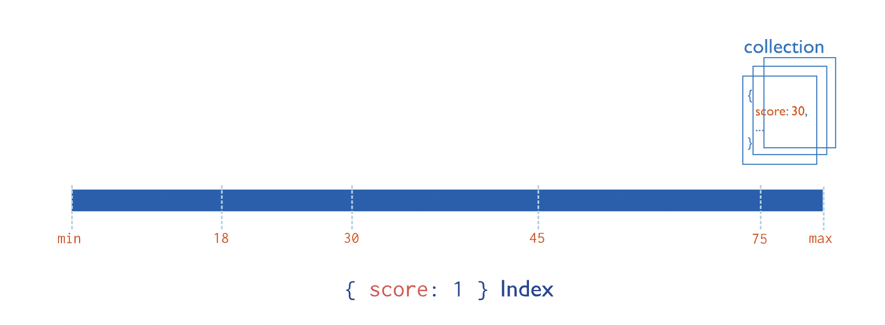
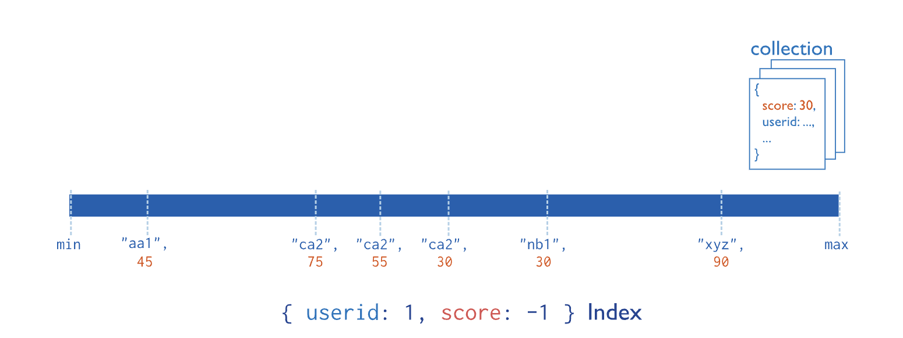
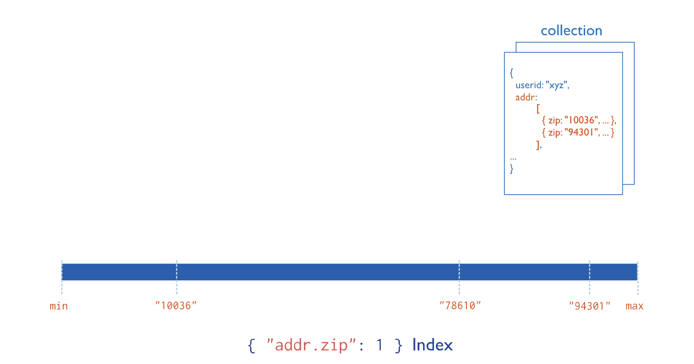

## 索引类型

本页描述了您可以在 MongoDB 中创建的索引类型。不同的索引类型支持不同类型的数据和查询。

### 单字段索引

单字段索引收集集合中每个文档中单个字段的数据并对其进行排序。

此图显示了单个字段上的索引`score`：

要了解更多信息，请参阅[单字段索引。](https://www.mongodb.com/docs/v7.0/core/indexes/index-types/index-single/#std-label-indexes-single-field)

### 复合索引

复合索引从集合中每个文档的两个或多个字段收集数据并对其进行排序。数据按索引中的第一个字段分组，然后按每个后续字段分组。

`userid`例如，下图显示了一个复合索引，其中文档首先按升序（按字母顺序）分组。然后，`scores`对每个按`userid`降序排序：

要了解更多信息，请参阅[复合索引。](https://www.mongodb.com/docs/v7.0/core/indexes/index-types/index-compound/#std-label-index-type-compound)

### 多键索引

多键索引收集并排序存储在数组中的数据。

您不需要显式指定多键类型。当您在包含数组值的字段上创建索引时，MongoDB 会自动将该索引设置为多键索引。

此图显示了字段上的多键索引`addr.zip`：

要了解更多信息，请参阅[多键索引。](https://www.mongodb.com/docs/v7.0/core/indexes/index-types/index-multikey/#std-label-index-type-multikey)

### 地理空间索引

地理空间索引可提高地理空间坐标数据查询的性能。要了解更多信息，请参阅[地理空间索引。](https://www.mongodb.com/docs/v7.0/core/indexes/index-types/index-geospatial/#std-label-geospatial-index)

MongoDB 提供两种类型的地理空间索引：

- 使用平面几何返回结果的[二维索引。](https://www.mongodb.com/docs/v7.0/core/indexes/index-types/geospatial/2d/#std-label-2d-index)
- 使用球面几何形状返回结果的[2dsphere 索引。](https://www.mongodb.com/docs/v7.0/core/indexes/index-types/geospatial/2dsphere/#std-label-2dsphere-index)

### 文本索引

文本索引支持对包含字符串内容的字段进行文本搜索查询。

要了解更多信息，请参阅[文本索引。](https://www.mongodb.com/docs/v7.0/core/indexes/index-types/index-text/#std-label-index-type-text)

> 笔记:
>
> **在 Atlas 部署上使用 Atlas 搜索**
>
> 对于托管在[MongoDB atlas](https://www.mongodb.com/docs/atlas/), MongoDB 提供了全文搜索解决方案，[图集搜索](https://www.mongodb.com/docs/atlas/atlas-search/)。与本地文本搜索相比，Atlas Search 提供了改进的性能和功能。

### 哈希索引

哈希索引支持[哈希分片](https://www.mongodb.com/docs/v7.0/core/hashed-sharding/#std-label-sharding-hashed-sharding)。散列索引对字段值的散列进行索引。

要了解更多信息，请参阅[哈希索引。](https://www.mongodb.com/docs/v7.0/core/indexes/index-types/index-hashed/#std-label-index-type-hashed)

### 聚集索引

*5.3版本中的新功能*。

[聚集索引指定聚集集合](https://www.mongodb.com/docs/v7.0/core/clustered-collections/#std-label-clustered-collections)存储数据的顺序。使用聚集索引创建的集合称为聚集集合。

要了解如何创建具有聚集索引的集合，请参阅 [聚集集合示例。](https://www.mongodb.com/docs/v7.0/core/clustered-collections/#std-label-clustered-collections-examples)