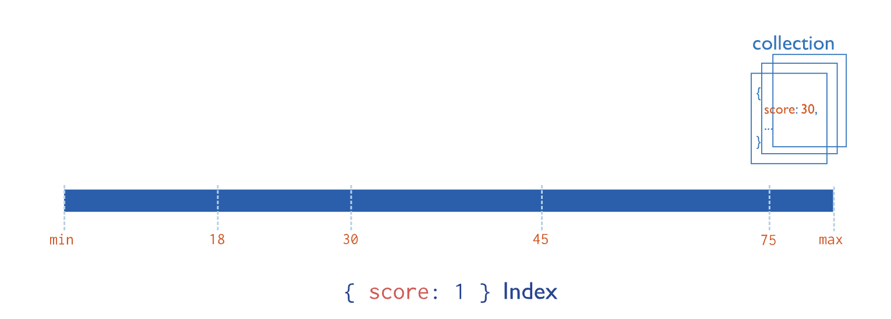

## 单字段索引

单字段索引存储集合中单个字段的信息。[默认情况下，所有集合在_id 字段](https://www.mongodb.com/docs/v7.0/indexes/#std-label-index-type-id)上都有一个索引。您可以添加额外的索引来加速重要的查询和操作。

单字段索引存储集合中单个字段的信息。[默认情况下，所有集合在_id 字段](https://www.mongodb.com/docs/v7.0/indexes/#std-label-index-type-id)上都有一个索引。您可以添加额外的索引来加速重要的查询和操作。

您可以在文档中的任何字段上创建单字段索引，包括：

- 顶级文档字段
- 嵌入文档
- 嵌入文档中的字段

创建索引时，您指定：

- 要在其上创建索引的字段。
- 索引值的排序顺序（升序或降序）。
  - `1`按升序对值进行排序的排序顺序。
  - `-1`按降序对值进行排序的排序顺序。

要创建单字段索引，请使用以下原型：

```
db.<collection>.createIndex( { <field>: <sortOrder> } )
```

此图显示了单个字段的升序索引`score`：



在此示例中，集合中具有该字段值的每个文档都`score`按升序添加到索引中。

### 用例

如果您的应用程序对同一字段重复运行查询，您可以在该字段上创建索引以提高性能。例如，您的人力资源部门经常需要通过员工 ID 查找员工。您可以在员工 ID 字段上创建索引以提高该查询的性能。

### 开始使用

要在单个字段上创建索引，请参阅以下示例：

- [在单个字段上创建索引](https://www.mongodb.com/docs/v7.0/core/indexes/index-types/index-single/create-single-field-index/#std-label-index-create-ascending-single-field)
- [在嵌入字段上创建索引](https://www.mongodb.com/docs/v7.0/core/indexes/index-types/index-single/create-single-field-index/#std-label-index-embedded-fields)
- [在嵌入文档上创建索引](https://www.mongodb.com/docs/v7.0/core/indexes/index-types/index-single/create-single-field-index/#std-label-index-embedded-documents)

### 细节

对于单字段索引，索引键的排序顺序（升序或降序）并不重要，因为 MongoDB 可以沿任一方向遍历索引。