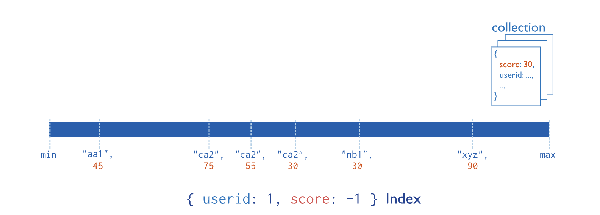

## 复合索引

复合索引从集合中每个文档的两个或多个字段收集数据并对其进行排序。数据按索引中的第一个字段分组，然后按每个后续字段分组。

`userid`例如，下图显示了一个复合索引，其中文档首先按升序（按字母顺序）分组。然后，`scores`对每个按`userid`降序排序：



要创建复合索引，请使用以下原型：

```
db.<collection>.createIndex( {
   <field1>: <sortOrder>,
   <field2>: <sortOrder>,
   ...
   <fieldN>: <sortOrder>
} )
```

### 用例

如果您的应用程序重复运行包含多个字段的查询，您可以创建复合索引来提高该查询的性能。例如，杂货店经理经常需要按名称和数量查找库存物品，以确定哪些物品库存不足。`item`您可以在和 字段上创建复合索引`quantity`以提高查询性能。

### 开始使用

要创建复合索引，请参阅[创建复合索引。](https://www.mongodb.com/docs/v7.0/core/indexes/index-types/index-compound/create-compound-index/#std-label-index-create-compound)

### 细节

本节介绍复合索引的技术细节和限制。

### 字段限制

单个复合索引最多可以包含 32 个字段。

### 字段顺序

索引字段的顺序会影响复合索引的有效性。复合索引根据索引中字段的顺序包含对文档的引用。要创建高效的复合索引，请遵循[ESR（相等、排序、范围）规则。](https://www.mongodb.com/docs/v7.0/tutorial/equality-sort-range-rule/#std-label-esr-indexing-rule)

### 排序

索引以升序 ( `1`) 或降序 ( `-1`) 排序顺序存储对字段的引用。对于复合索引，排序顺序可以决定索引是否支持排序操作。有关详细信息，请参阅[复合索引排序顺序。](https://www.mongodb.com/docs/v7.0/core/indexes/index-types/index-compound/sort-order/#std-label-index-compound-sort-order)

### 哈希索引字段

- 在 MongoDB 4.4 及更高版本中，复合索引可能包含**单个** [哈希索引字段。](https://www.mongodb.com/docs/v7.0/core/indexes/index-types/index-hashed/#std-label-index-type-hashed)
- 在 MongoDB 4.2 及更早版本中，复合索引不能包含任何哈希索引字段。

### 索引前缀

索引前缀是索引字段的开始子集。复合索引支持对索引前缀中包含的所有字段进行查询。

例如，考虑这个复合索引：

```
{ "item": 1, "location": 1, "stock": 1 }
```

该索引具有以下索引前缀：

- `{ item: 1 }`
- `{ item: 1, location: 1 }`

MongoDB可以使用复合索引来支持对这些字段组合的查询：

- `item`
- `item`和`location`
- `item`, `location`, 和`stock`

MongoDB 还可以使用索引来支持对`item`和 `stock`字段的查询，因为`item`字段对应于前缀。但是，只有`item`索引中的字段可以支持这种查询。查询不能使用`stock`后面的字段`location`。

索引字段按顺序解析；如果查询省略索引前缀，则无法使用该前缀后面的任何索引字段。

MongoDB**无法**使用复合索引来支持这些字段组合的查询：

- `location`
- `stock`
- `location`和`stock`

如果没有该`item`字段，则前面的字段组合都不对应前缀索引。

> 提示:
>
> **删除冗余索引**
>
> 如果您的集合同时具有复合索引和前缀索引（例如`{ a: 1, b: 1 }`和`{ a: 1 }`），并且两个索引都没有[稀疏](https://www.mongodb.com/docs/v7.0/core/index-sparse/#std-label-index-type-sparse)或[唯一](https://www.mongodb.com/docs/v7.0/core/index-unique/#std-label-index-type-unique)约束，则可以删除前缀 ( `{ a: 1 }`) 上的索引。MongoDB 在所有需要使用前缀索引的情况下都使用复合索引。

### 稀疏复合索引

复合索引可以包含不同类型的稀疏索引。索引类型的组合决定了复合索引如何匹配文档。

下表总结了包含不同类型稀疏索引的复合索引的行为：

| 复合索引组件                                                 | 复合索引的行为                                               |
| :----------------------------------------------------------- | :----------------------------------------------------------- |
| 升序指数降序索引                                             | 仅索引至少包含一个键的值的文档。                             |
| 升序指数降序索引[地理空间索引](https://www.mongodb.com/docs/v7.0/geospatial-queries/#std-label-index-feature-geospatial) | 仅当文档包含某个字段的值时才索引该文档`geospatial`。不按升序或降序索引对文档进行索引。 |
| 升序指数降序索引[文本索引](https://www.mongodb.com/docs/v7.0/core/indexes/index-types/index-text/#std-label-index-feature-text) | 仅当文档与其中一个`text` 字段匹配时才索引该文档。不按升序或降序索引对文档进行索引。 |

### 了解更多

要了解如何创建高效的复合索引，请参阅 [ESR（相等、排序、范围）规则。](https://www.mongodb.com/docs/v7.0/tutorial/equality-sort-range-rule/#std-label-esr-indexing-rule)