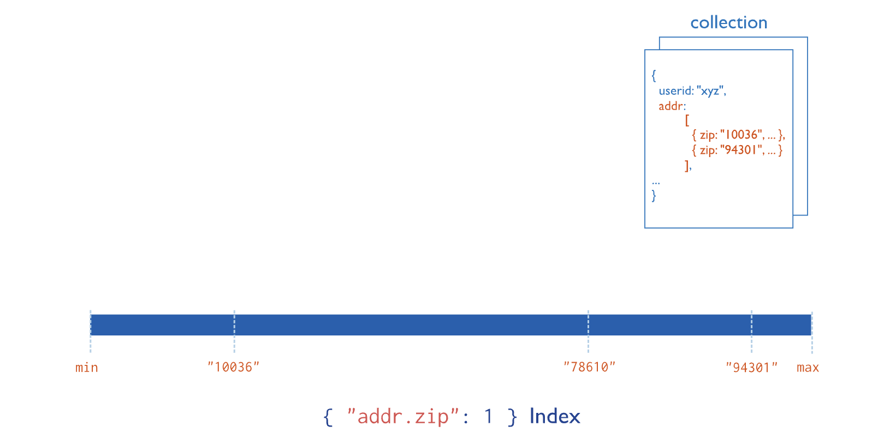

### 多键索引

多键索引从包含数组值的字段收集数据并对其进行排序。多键索引提高了数组字段查询的性能。

您不需要显式指定多键类型。当您在包含数组值的字段上创建索引时，MongoDB 会自动将该索引设置为多键索引。

MongoDB 可以在包含标量值（例如字符串和数字）和嵌入文档的数组上创建多键索引。

要创建多键索引，请使用以下原型：

```
db.<collection>.createIndex( { <arrayField>: <sortOrder> } )
```

要创建多键索引，请使用以下原型：

```
db.<collection>.createIndex( { <arrayField>: <sortOrder> } )
```

此图显示了字段上的多键索引`addr.zip`：



### 用例

如果您的应用程序频繁查询包含数组值的字段，则多键索引可提高这些查询的性能。

例如，`students`集合中的文档包含一个 `test_scores`字段：学生在整个学期收到的考试成绩的数组。您定期更新尖子生列表：至少有 5 个`test_scores`大于 的学生`90`。

您可以在字段上创建索引`test_scores`以提高此查询的性能。由于`test_scores`包含数组值，MongoDB 将索引存储为多键索引。

### 开始使用

要创建多键索引，请参阅：

- [在数组字段上创建索引](https://www.mongodb.com/docs/v7.0/core/indexes/index-types/index-multikey/create-multikey-index-basic/#std-label-index-create-multikey-scalar)
- [在数组中的嵌入字段上创建索引](https://www.mongodb.com/docs/v7.0/core/indexes/index-types/index-multikey/create-multikey-index-embedded/#std-label-index-create-multikey-embedded)

### 细节

本节介绍多键索引的技术细节和限制。

#### 索引边界

索引扫描的范围定义了查询期间要搜索的索引部分。多键索引边界的计算遵循特殊规则。有关详细信息，请参阅[多键索引边界。](https://www.mongodb.com/docs/v7.0/core/indexes/index-types/index-multikey/multikey-index-bounds/#std-label-indexes-multikey-bounds)

#### 唯一的多键索引

在[唯一](https://www.mongodb.com/docs/v7.0/core/index-unique/#std-label-index-type-unique)多键索引中，文档可能具有导致重复索引键值的数组元素，只要该文档的索引键值不与另一个文档的索引键值重复即可。

要了解更多信息并查看此行为的示例，请参阅 [跨单独文档的唯一约束。](https://www.mongodb.com/docs/v7.0/core/index-unique/#std-label-unique-separate-documents)

#### 复合多键索引

在[复合多键索引中，每个索引文档](https://www.mongodb.com/docs/v7.0/core/indexes/index-types/index-compound/#std-label-index-type-compound)*最多*可以有一个索引字段，其值为数组。具体来说：

- 如果索引规范中多个字段是数组，则无法创建复合多键索引。例如，考虑包含此文档的集合：

  ```
  { _id: 1, scores_spring: [ 8, 6 ], scores_fall: [ 5, 9 ] }
  ```

  您无法创建复合多键索引，`{ scores_spring: 1, scores_fall: 1 }`因为索引中的两个字段都是数组。

- 如果复合多键索引已存在，则无法插入违反此限制的文档。

  考虑包含以下文档的集合：

  ```
  { _id: 1, scores_spring: [8, 6], scores_fall: 9 }
  { _id: 2, scores_spring: 6, scores_fall: [5, 7] }
  ```

  您可以创建复合多键索引`{ scores_spring: 1, scores_fall: 1 }`，因为对于每个文档，只有一个由复合多键索引索引的字段是数组。没有文档同时包含`scores_spring`和`scores_fall`字段的数组值。

  但是，在创建复合多键索引后，如果尝试插入`scores_spring`和`scores_fall` 字段均为数组的文档，则插入会失败。

#### 排序

当您根据使用 a 索引的数组字段进行排序时 [多键索引](https://www.mongodb.com/docs/v7.0/core/indexes/index-types/index-multikey/#std-label-index-type-multikey)，查询计划包括 [阻塞排序](https://www.mongodb.com/docs/v7.0/reference/glossary/#std-term-blocking-sort)阶段，除非以下两个条件都成立：

- 所有排序字段的索引[边界](https://www.mongodb.com/docs/v7.0/core/indexes/index-types/index-multikey/multikey-index-bounds/#std-label-multikey-index-bounds-intersecting)`[MinKey, MaxKey]`都是。
- 任何多键索引字段的边界都不具有与排序模式相同的路径前缀。

#### 片键

您不能将多键索引指定为分片键索引。

但是，如果分片键索引是复合索引的[前缀](https://www.mongodb.com/docs/v7.0/core/indexes/index-types/index-compound/#std-label-compound-index-prefix)，则如果尾随键之一（不是分片键的一部分）对数组进行索引，则复合索引可能会成为复合*多键索引。*

#### 散列索引

[散列索引](https://www.mongodb.com/docs/v7.0/core/indexes/index-types/index-hashed/#std-label-index-type-hashed)不能是多键的。

#### 涵盖查询

多键索引不能[覆盖](https://www.mongodb.com/docs/v7.0/core/query-optimization/#std-label-covered-queries)数组字段的查询。但是，如果索引跟踪哪个或哪些字段导致索引成为多键，则多键索引可以涵盖对非数组字段的查询。

例如，考虑`matches`包含以下文档的集合：

```
db.matches.insertMany( [
   { name: "joe", event: ["open", "tournament"] },
   { name: "bill", event: ["match", "championship"] }
] )
```

该集合在 和字段`matches`上有一个复合多键索引：`name``event`

```
db.matches.createIndex( { name: 1, event: 1 } )
```

该索引是多键索引，因为该`event`字段包含数组值。

多键索引涵盖以下查询，即使匹配字段 ( `name`) 不是数组：

```
db.matches.find( { name: "bill" } )
```

因为`name`field 是索引[前缀](https://www.mongodb.com/docs/v7.0/core/indexes/index-types/index-compound/#std-label-compound-index-prefix)的一部分，所以索引覆盖了对`name` field 的查询。`name`该索引无法同时涵盖和上的查询`event`，因为多键索引无法涵盖数组字段上的查询。

#### 查询整个数组字段

当查询过滤器指定[整个数组的精确匹配](https://www.mongodb.com/docs/v7.0/tutorial/query-arrays/#std-label-array-match-exact)时，MongoDB可以使用多键索引来查找查询数组的*第一个元素，但不能使用多键索引扫描来查找整个数组。*

相反，在使用多键索引查找查询数组的第一个元素后，MongoDB 会检索关联文档并筛选其数组与查询中的数组匹配的文档。

例如，考虑`inventory`包含以下文档的集合：

```
db.inventory.insertMany( [
   { _id: 5, type: "food", item: "apple", ratings: [ 5, 8, 9 ] }
   { _id: 6, type: "food", item: "banana", ratings: [ 5, 9 ] }
   { _id: 7, type: "food", item: "chocolate", ratings: [ 9, 5, 8 ] }
   { _id: 8, type: "food", item: "fish", ratings: [ 9, 5 ] }
   { _id: 9, type: "food", item: "grapes", ratings: [ 5, 9, 5 ] }
] )
```

该`inventory`集合在字段上有一个多键索引`ratings` ：

```
db.inventory.createIndex( { ratings: 1 } )
```

以下查询查找字段为`ratings`数组的文档`[ 5, 9 ]`：

```
db.inventory.find( { ratings: [ 5, 9 ] } )
```

MongoDB 可以使用多键索引来查找数组`5`中任意位置的文档`ratings`。`ratings`然后，MongoDB 检索这些文档并过滤数组等于查询数组的文档`[ 5, 9 ]`。

#### $表达式

该[`$expr`](https://www.mongodb.com/docs/v7.0/reference/operator/query/expr/#mongodb-query-op.-expr)运算符不支持多键索引。

### 了解更多

- 要了解 MongoDB 如何结合多键索引边界来提高性能，请参阅[多键索引边界。](https://www.mongodb.com/docs/v7.0/core/indexes/index-types/index-multikey/multikey-index-bounds/#std-label-indexes-multikey-bounds)
- 要了解如何查询数组字段，请参阅：
  - [查询数组](https://www.mongodb.com/docs/v7.0/tutorial/query-arrays/#std-label-read-operations-arrays)
  - [查询嵌入文档数组](https://www.mongodb.com/docs/v7.0/tutorial/query-array-of-documents/#std-label-array-match-embedded-documents)