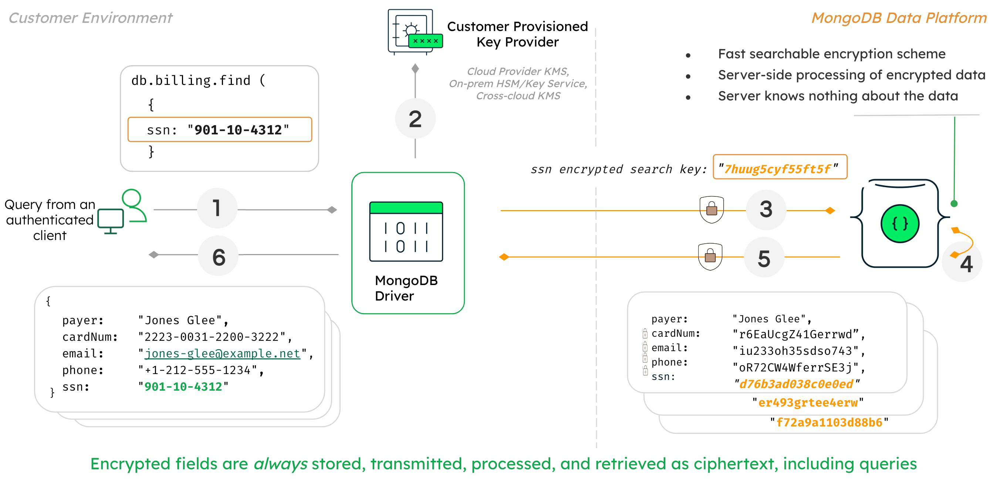
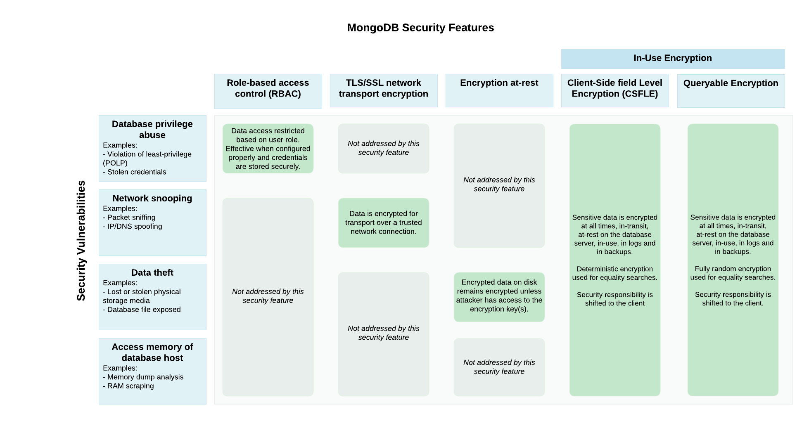

# 特征

> 注意:
>
> Queryable Encryption 处于公共预览阶段，可用于评估目的。不建议将公共预览版用于生产部署，因为可能会引入重大更改。要了解有关预览版的更多信息，请参阅[可查询加密预览](https://www.mongodb.com/blog/post/mongodb-releases-queryable-encryption-preview/)博客文章。

## 概述

在此页面上，您可以了解可查询加密的安全优势、可查询加密的工作原理以及可查询加密与 MongoDB 支持的其他安全机制的比较。您还可以查看一个虚构的场景，该场景展示了可查询加密在保护数据方面的价值。

## 可查询加密

可查询加密是 MongoDB 的一项功能，它使客户端应用程序能够在使用完全随机加密通过网络传输数据之前加密数据，同时保持可查询性。敏感数据由客户端透明地加密和解密，并且仅以加密形式与服务器通信。包含低基数（低频）数据和高基数数据的敏感字段的安全保证是相同的

与可以使用[确定性加密的](https://www.mongodb.com/docs/manual/core/csfle/fundamentals/encryption-algorithms/#std-label-csfle-deterministic-encryption)[客户端字段级加密](https://www.mongodb.com/docs/manual/core/csfle/#std-label-manual-csfle-feature)不同，可查询加密使用快速、可搜索的加密方案，基于 [结构化加密](https://dl.acm.org/doi/abs/10.1007/978-3-030-77883-5_13) 始终将给定的明文输入值加密为不同的加密输出值。

## 可查询加密的工作原理

下图显示了如何在客户环境中使用可查询加密的过程和架构。

在此图中，用户能够查询完全随机加密的数据，例如 SSN 号码。

在可查询加密框架中实现这一点的过程和机制如下：

1. 当应用程序提交查询时，MongoDB 驱动程序首先分析查询。
2. 驱动程序识别出查询是针对加密字段的，并从客户提供的密钥提供程序请求加密密钥，例如：
   * AWS 密钥管理服务 (AWS KMS)
   * 谷歌云 KMS
   * Azure 密钥保管库
   * 任何符合KMIP 的密钥提供程序
3. 驱动程序将查询提交给 MongoDB 服务器，并将加密字段呈现为密文。
4. 可查询加密实现了一种快速、可搜索的方案，允许服务器处理对完全加密数据的查询，而无需了解数据的任何信息。数据和查询本身在服务器上始终保持加密状态。
5. MongoDB 服务器将查询的加密结果返回给驱动程序。
6. 查询结果使用驱动程序持有的密钥解密并返回给客户端并以明文形式显示。

可查询加密函数在以下数据结构的帮助下发挥作用。重要的是不要修改或删除这些，否则查询结果将不正确。

* Queryable Encryption`__safeContent__`向任何集合中存在 Queryable Encryption 加密字段的文档添加一个字段。
* 可查询加密在与具有可查询加密加密字段的集合相同的数据库中创建三个元数据集合。这些名称如下：
  * `enxcol_.<collectionName>.esc`
  * `enxcol_.<collectionName>.ecc`
  * `enxcol_.<collectionName>.ecoc`

> 警告:
>
> 不要修改这些数据结构，否则查询结果将不正确，并且可能会影响安全性。

可查询加密在以下情况下确保加密字段的安全：

- 数据库超级用户直接访问加密字段
- 通过读取服务器的内存访问加密字段
- 通过不安全的网络捕获加密字段
- 通过读取数据库或备份文件访问磁盘上的加密字段
- 通过识别加密文档中的模式进行频率分析攻击

虽然所有客户端都可以访问非敏感数据字段，但只有经过适当配置的可查询加密客户端才能使用加密数据字段运行读写查询。

>重要的:
>
>**远程密钥管理系统**
>
>当您在生产中使用可查询加密时，您必须使用远程密钥管理系统 (KMS) 来存储您的加密密钥。
>
>要查看演示如何使用带有可查询加密的远程 KMS 的分步指南，请参阅[教程。](https://www.mongodb.com/docs/manual/core/queryable-encryption/tutorials/#std-label-qe-tutorial-automatic-encryption)
>
>要查看所有受支持的 KMS 提供商的列表，请参阅 [KMS 提供商。](https://www.mongodb.com/docs/manual/core/queryable-encryption/fundamentals/kms-providers/#std-label-qe-fundamentals-kms-providers)
>
>要详细了解为何应使用远程 KMS，请参阅 [使用远程 KMS 的原因。](https://www.mongodb.com/docs/manual/core/queryable-encryption/fundamentals/manage-keys/#std-label-qe-reasons-to-use-remote-kms)

## 其他安全机制

本节描述了 MongoDB 支持的以下安全机制，并解释了它们的用例和限制：

- [基于角色的访问控制](https://www.mongodb.com/docs/manual/core/queryable-encryption/features/#std-label-qe-features-role-based-access-control)
- [静态加密](https://www.mongodb.com/docs/manual/core/queryable-encryption/features/#std-label-qe-features-encryption-at-rest)
- [传输加密 (TLS/SSL)](https://www.mongodb.com/docs/manual/core/queryable-encryption/features/#std-label-qe-features-transport-encryption)

### 基于角色的访问控制

基于角色的访问控制是一种安全机制，允许管理员为用户授予和限制集合级别的权限。通过适当的角色定义和分配，此解决方案可防止意外泄露数据和访问权限。

基于角色的访问控制无法防止以下情况：

* 通过不安全的网络捕获数据
* 通过读取数据库或备份文件访问磁盘数据
* 通过读取服务器的内存来访问数据
* 数据库超级用户直接访问数据

要了解更多信息，请参阅 [基于角色的访问控制。](https://www.mongodb.com/docs/manual/core/authorization/)

### 静态加密

静态加密是一种加密磁盘上的数据库文件的机制。此机制可防止缺少数据库凭据但有权访问托管数据库的计算机的人查看您的数据。

此机制不会保护您的数据免受以下情况的影响：

- 通过不安全的网络捕获数据
- 通过读取服务器的内存来访问数据
- 数据库超级用户直接访问数据

要了解更多信息，请参阅 [静态加密。](https://www.mongodb.com/docs/manual/core/security-encryption-at-rest/)

### 传输加密 (TLS/SSL)

使用 TLS/SSL 的传输加密通过网络加密您的数据。TLS/SSL 在您的数据通过不安全的网络传输时保护您的数据，但不能保护您的数据免受特权用户的侵害或因为它位于磁盘上。

要了解更多信息，请参阅 [使用 TLS/SSL 的传输加密](https://www.mongodb.com/docs/manual/core/security-transport-encryption/)

> 重要的:
>
> **一起使用这些机制**
>
> 要保护生产部署，请同时使用本指南中讨论的所有安全机制。这些机制并不相互排斥。

## 功能比较

下图描述了 MongoDB 支持的安全特性以及它们解决的潜在安全漏洞：

> 重要的:
>
> **一起使用这些机制**
>
> 要保护生产部署，请同时使用本指南中讨论的所有安全机制。这些机制并不相互排斥。

## 设想

以下虚构场景演示了可查询加密在保护应用程序数据方面的价值，以及可查询加密如何与本指南中讨论的其他安全机制交互。

在这种情况下，我们保护医疗保健管理系统上的敏感数据，该系统存储患者的个人信息、账单信息和虚构公司*MedcoMD*的医疗记录。没有任何患者数据是公开的，并且特定数据，如他们的社会安全号码（SSN，美国政府颁发的身份证号码）、患者 ID 号码、账单信息和药物信息特别敏感，并受隐私合规性约束。对公司和患者而言，保持数据的私密性和安全性非常重要。

MedcoMD 需要此系统来满足以下用例：

* 医生使用该系统访问患者的病历、账单信息和更新药物。
* 接待员使用该系统使用患者的联系信息来验证患者的身份。
* 接待员可以查看患者的账单信息，但不能查看他们的患者 ID 号。
* 接待员无法访问患者的病历。

MedcoMD 还关注通过以下任何方法泄露敏感数据：

- 接待员公开屏幕上的数据意外泄露。
- 由超级用户（如数据库管理员）直接访问数据库。
- 通过不安全的网络捕获数据。
- 通过读取数据库服务器的内存来访问数据。
- 通过读取数据库或备份文件来访问数据。

MedcoMD 如何平衡其医疗管理系统的功能和访问限制？

### 解决方案

MedcoMD 使用以下安全机制来满足其用例并防止敏感医疗数据泄露：

* [传输加密 (TLS/SSL)](https://www.mongodb.com/docs/manual/core/queryable-encryption/features/#std-label-qe-features-transport-encryption) 以保护数据在网络上传输时的安全。
* [静态加密](https://www.mongodb.com/docs/manual/core/queryable-encryption/features/#std-label-qe-features-encryption-at-rest) 通过读取数据库或备份文件来防止数据泄露。
* [基于角色的访问控制](https://www.mongodb.com/docs/manual/core/queryable-encryption/features/#std-label-qe-features-role-based-access-control) 限制数据库用户访问他们执行任务所需的集合。
* 使用可查询加密加密敏感字段以满足以下用例和约束：
  * 防止从服务器内存中读取数据，因为可查询加密加密数据永远不会以未加密的形式存在于数据库服务器上。
  * 通过向接待员提供未启用可查询加密的客户端，允许接待员验证患者的身份并防止在接待员的公开屏幕上意外泄露敏感数据。
  * 通过为医生提供启用了可查询加密的客户端，允许医生在他们的办公室私下查看敏感数据。

## 了解更多

要查看您应该实施以保护 MongoDB 部署的安全措施列表，请参阅 [安全清单。](https://www.mongodb.com/docs/manual/administration/security-checklist/)

要开始使用可查询加密，请参阅[快速入门。](https://www.mongodb.com/docs/manual/core/queryable-encryption/quick-start/#std-label-qe-quick-start)

译者：韩鹏帅

原文：[Features](https://www.mongodb.com/docs/manual/core/queryable-encryption/features/)
