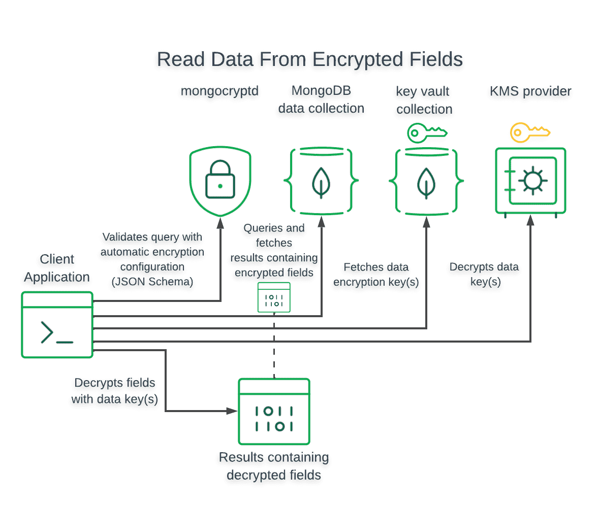

## 自动加密

MongoDB 支持在使用客户端字段级加密时自动加密读写操作中的字段。您可以使用执行自动加密[`mongosh`](https://www.mongodb.com/docs/mongodb-shell/#mongodb-binary-bin.mongosh)以及与 4.2 及更高版本兼容的官方 MongoDB 驱动程序。有关支持 CSFLE 的官方兼容驱动程序的完整列表，请参阅驱动程序兼容性[CSFLE 兼容性。](https://www.mongodb.com/docs/manual/core/csfle/reference/compatibility/#std-label-csfle-driver-compatibility)

## 加密的写入和读取如何工作

下图显示了客户端应用程序和驱动程序如何写入和读取字段级加密数据。

### 加密写入

对于写入操作，驱动程序在写入 MongoDB 数据库之前*加密字段值。*

下图显示了客户端应用程序和驱动程序执行字段级加密数据写入所采取的步骤：


### 加密读取

对于读取操作，驱动程序在发出读取操作之前*加密*查询中的字段值 。

*对于返回加密字段的读取操作，仅当*驱动程序配置为可以访问用于加密这些值的客户主密钥 (CMK) 和数据加密密钥 (DEK) 时，驱动程序才会自动解密加密值。

下图显示了客户端应用程序和驱动程序查询和解密字段级加密数据所采取的步骤：



## 启用自动客户端字段级加密

要启用自动加密，请在您的客户端`MongoClient`实例中指定自动加密设置。

以下代码片段显示了如何创建一个在`mongosh`MongoDB 驱动程序中启用自动加密的客户端：

```
var clientSettings = MongoClientSettings.FromConnectionString(_connectionString);
var autoEncryptionOptions = new AutoEncryptionOptions(
    keyVaultNamespace: keyVaultNamespace,
    kmsProviders: kmsProviders,
    schemaMap: schemaMap,
    extraOptions: extraOptions);
clientSettings.AutoEncryptionOptions = autoEncryptionOptions;
var client = new MongoClient(clientSettings);

```

有关 CSFLE 特定`MongoClient`设置的更多信息，请参阅[CSFLE 特定的 MongoClient 选项。](https://www.mongodb.com/docs/manual/core/csfle/reference/csfle-options-clients/#std-label-csfle-reference-mongo-client)

## 服务器端字段级加密实施

MongoDB 支持使用[模式验证](https://www.mongodb.com/docs/manual/core/schema-validation/#std-label-schema-validation-overview)来强制加密集合中的特定字段。执行自动客户端字段级加密的客户端具有特定的行为，具体取决于数据库连接配置：

* 如果连接 [autoEncryptionOpts](https://www.mongodb.com/docs/manual/core/csfle/reference/csfle-options-clients/#std-label-csfle-enc-options-example) `schemaMap`对象包含指定集合的密钥，则客户端使用该对象执行自动字段级加密并忽略远程模式。至少，本地规则**必须** 加密远程模式标记为需要加密的那些字段。

* 如果连接 [autoEncryptionOpts](https://www.mongodb.com/docs/manual/core/csfle/reference/csfle-options-clients/#std-label-csfle-enc-options-example) `schemaMap`对象不*包含*指定集合的密钥，则客户端下载该集合的服务器端远程模式并使用它来执行自动字段级加密。

  > 重要的:
  >
  > **行为注意事项**
  >
  > 当`autoEncryptionOpts`不包含指定集合的键时：
  >
  > - 客户端相信服务器具有关于自动字段级加密的有效模式。
  > - 客户端使用远程模式仅执行自动 CSFLE。客户端不强制执行模式中指定的任何其他验证规则。

要了解如何设置服务器端 CSFLE 实施，请参阅[CSFLE 服务器端架构实施。](https://www.mongodb.com/docs/manual/core/csfle/reference/server-side-schema/#std-label-csfle-reference-server-side-schema)


译者：韩鹏帅

原文：[Automatic Encryption](https://www.mongodb.com/docs/manual/core/csfle/fundamentals/automatic-encryption/)