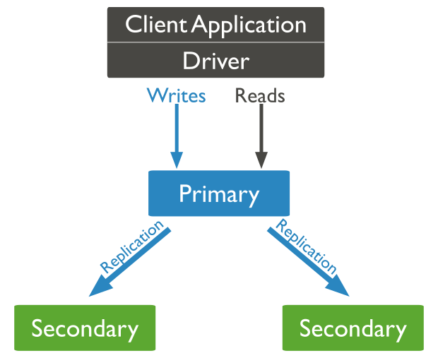

# 副本集主

主节点是副本集中唯一接收写入操作的成员。[MongoDB 在主](https://www.mongodb.com/docs/manual/reference/glossary/#std-term-primary)数据库上应用写操作，然后在主数据库的[oplog](https://www.mongodb.com/docs/manual/core/replica-set-oplog/)上记录操作。[次要](https://www.mongodb.com/docs/manual/core/replica-set-members/#std-label-replica-set-secondary-members)成员复制此日志并将操作应用于其数据集。

在下面的三成员副本集中，主副本接受所有写操作。然后辅助节点复制 oplog 以应用于它们的数据集。

点击放大

副本集的所有成员都可以接受读操作。但是，默认情况下，应用程序将其读取操作定向到主要成员。有关更改默认读取行为的详细信息，请参阅[读取首选项](https://www.mongodb.com/docs/manual/core/read-preference/)。

副本集最多可以有一个主副本。 [[ 1 \]](https://www.mongodb.com/docs/manual/core/replica-set-primary/#footnote-edge-cases-2-primaries)如果当前主节点不可用，将通过选举确定新的主节点。有关详细信息，请参阅 [副本集选举。](https://www.mongodb.com/docs/manual/core/replica-set-elections/)

在下面的 3-member 副本集中，primary 变得不可用。这会触发选举，选择剩余的一个辅助节点作为新的主要节点。

点击放大

| [ [1](https://www.mongodb.com/docs/manual/core/replica-set-primary/#ref-edge-cases-2-primaries-id1) ] | 在[某些情况下](https://www.mongodb.com/docs/manual/core/read-preference-use-cases/#std-label-edge-cases)，副本集中的两个节点可能会*暂时*认为它们是主节点，但至多，其中一个节点将能够完成具有[`{ w: "majority" }`](https://www.mongodb.com/docs/manual/reference/write-concern/#mongodb-writeconcern-writeconcern.-majority-)写入关注的写入。可以完成 [`{ w: "majority" }`](https://www.mongodb.com/docs/manual/reference/write-concern/#mongodb-writeconcern-writeconcern.-majority-)写入的节点是当前主节点，另一个节点是尚未识别其降级的前主节点，通常是由于[网络分区](https://www.mongodb.com/docs/manual/reference/glossary/#std-term-network-partition)。发生这种情况时，连接到前一个主节点的客户端可能会观察到过时的数据，尽管已经请求了读取偏好 [`primary`](https://www.mongodb.com/docs/manual/core/read-preference/#mongodb-readmode-primary)，并且对前一个主节点的新写入最终将回滚。 |
| ------------------------------------------------------------ | ------------------------------------------------------------ |
|                                                              |                                                              |

←  [副本集成员](https://www.mongodb.com/docs/manual/core/replica-set-members/)[副本集次要成员](https://www.mongodb.com/docs/manual/core/replica-set-secondary/) →

原文链接 - https://docs.mongodb.com/manual/core/replica-set-primary/ 

译者：陆文龙

