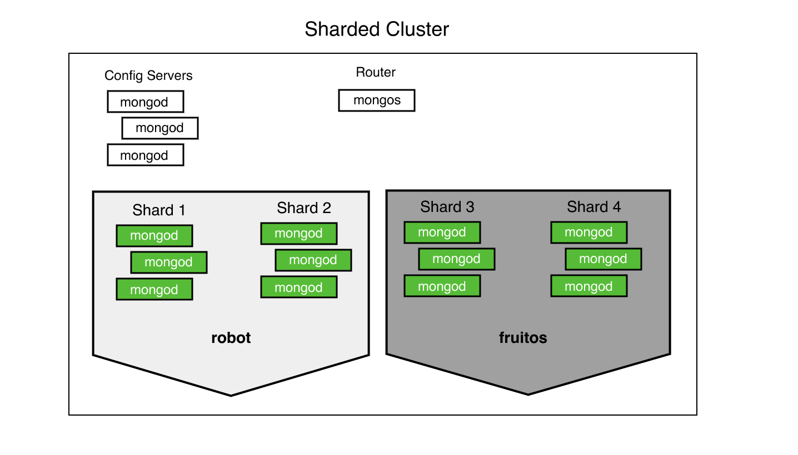

# 按应用程序或客户细分数据

在分片集群中，您可以根据[分片键](https://www.mongodb.com/docs/v4.4/reference/glossary/#std-term-shard-key)创建分片数据的[区域](https://www.mongodb.com/docs/v4.4/reference/glossary/#std-term-zone)。您可以将每个区域与集群中的一个或多个分片相关联。一个分片可以与任意数量的区域关联。在平衡集群中，MongoDB仅将区域覆盖的[块迁移到与该区域关联的分片。](https://www.mongodb.com/docs/v4.4/reference/glossary/#std-term-chunk)

> 提示:
>
> *通过在对空的或不存在的集合进行分片之前*定义区域和区域范围，分片收集操作会为定义的区域范围创建块以及任何其他块以覆盖分片键值的整个范围，并执行初始操作基于区域范围的块分配。块的初始创建和分配允许更快地设置分区分片。初始分配后，平衡器管理后续的块分配。
>
> 有关示例，请参阅[为空或不存在的集合预定义区域和区域范围。](https://www.mongodb.com/docs/v4.4/reference/method/sh.updateZoneKeyRange/#std-label-pre-define-zone-range-example)

本教程向您展示如何使用[Zones来分段数据。](https://www.mongodb.com/docs/v4.4/core/zone-sharding/#std-label-zone-sharding)

考虑以下场景，可能需要按应用程序或客户对数据进行分段：

- 一个数据库服务于多个应用程序
- 为多个客户提供服务的数据库
- 需要隔离应用程序或客户数据的范围或子集的数据库
- 需要为应用程序或客户数据的范围或子集分配资源的数据库

此图说明了使用区域根据应用程序或客户对数据进行分段的分片集群。这允许将数据隔离到特定的分片。此外，每个分片可以分配特定的硬件，以满足该分片上存储的数据的性能要求。


## 设想

应用程序跟踪用户的分数以及字段`client`，将分数存储在`gamify`数据库中的集合下`users`。每个可能的值都`client`需要有自己的区域以允许数据分段。它还允许管理员优化与性能和成本相关的每个分片的硬件`client`。

以下文档代表了两个用户的部分视图：

```
{
  "_id" : ObjectId("56f08c447fe58b2e96f595fa"),
  "client" : "robot",
  "userid" : 123,
  "high_score" : 181,
  ...,
}
{
  "_id" : ObjectId("56f08c447fe58b2e96f595fb"),
  "client" : "fruitos",
  "userid" : 456,
  "high_score" : 210,
  ...,
}
```

### 片键

该`users`集合使用`{ client : 1, userid : 1 }`复合索引作为分片键。

每个文档中的字段`client`允许为每个不同的客户值创建一个区域。

该字段 为分片键`userid`提供了相对于 的高[基数](https://www.mongodb.com/docs/v4.4/core/sharding-shard-key/#std-label-shard-key-cardinality)和低频[分量](https://www.mongodb.com/docs/v4.4/core/sharding-shard-key/#std-label-shard-key-frequency)`country`。

[有关选择分片键](https://www.mongodb.com/docs/v4.4/core/sharding-shard-key/#std-label-sharding-shard-key-requirements)的更多一般说明，请参阅选择分片键。

### Architecture

该应用程序需要将分片添加到与特定 `client`.

分片集群部署目前由四个[分片组成。](https://www.mongodb.com/docs/v4.4/reference/glossary/#std-term-shard)


### 区域

对于此应用程序，有两个客户端区域。



机器人客户端（“机器人”）

该区域代表`client : robot`.

FruitOS 客户端（“fruitos”）

该区域代表`client : fruitos`.

### 写操作

对于区域，如果插入或更新的文档与配置的区域匹配，则只能将其写入该区域内的分片。

MongoDB 可以将与配置的区域不匹配的文档写入集群中的任何分片。

> 笔记:
>
> 上述行为要求集群处于稳定状态，没有块违反配置的区域。有关更多信息，请参阅以下有关平衡器的[部分](https://www.mongodb.com/docs/v4.4/tutorial/sharding-tiered-hardware-for-varying-slas/#std-label-sharding-tiered-hardware-balancing)。

### 读操作

如果查询至少包含该字段，MongoDB 可以将查询路由到特定分片`client`。

例如，MongoDB 可以尝试对以下查询进行[有针对性的读取操作：](https://www.mongodb.com/docs/v4.4/core/sharded-cluster-query-router/#std-label-sharding-mongos-targeted)

```
chatDB = db.getSiblingDB("gamify")
chatDB.users.find( { "client" : "robot" , "userid" : "123" } )
```

没有该`client`字段的查询执行[广播操作。](https://www.mongodb.com/docs/v4.4/core/sharded-cluster-query-router/#std-label-sharding-mongos-broadcast)

### 平衡器

平衡器将块[迁移到尊重任何配置区域](https://www.mongodb.com/docs/v4.4/core/sharding-data-partitioning/#std-label-sharding-chunk-migration)[的](https://www.mongodb.com/docs/v4.4/core/sharding-balancer-administration/#std-label-sharding-balancing) 适当分片。在迁移之前，分片可能包含违反配置区域的块。平衡完成后，分片应仅包含其范围不违反其分配区域的块。

添加或删除区域或区域范围可能会导致块迁移。根据数据集的大小以及区域或区域范围影响的块数量，这些迁移可能会影响集群性能。考虑在特定的计划窗口期间运行[平衡器](https://www.mongodb.com/docs/v4.4/core/sharding-balancer-administration/#std-label-sharding-balancing)。有关如何设置计划窗口的教程，请参阅计划[平衡窗口。](https://www.mongodb.com/docs/v4.4/tutorial/manage-sharded-cluster-balancer/#std-label-sharding-schedule-balancing-window)

### 安全

[对于使用基于角色的访问控制](https://www.mongodb.com/docs/v4.4/core/authorization/#std-label-authorization)运行的分片集群，请以至少具有数据库[`clusterManager`](https://www.mongodb.com/docs/v4.4/reference/built-in-roles/#mongodb-authrole-clusterManager)角色的用户身份进行身份验证`admin`。

## 程序

您必须连接到[`mongos`](https://www.mongodb.com/docs/v4.4/reference/program/mongos/#mongodb-binary-bin.mongos)与目标 [分片集群](https://www.mongodb.com/docs/v4.4/reference/glossary/#std-term-sharded-cluster)关联才能继续。您无法通过直接连接到[分片来创建区域或区域范围。](https://www.mongodb.com/docs/v4.4/reference/glossary/#std-term-shard)

1. 禁用平衡器

   必须在集合上禁用平衡器，以确保在配置新区域时不会发生迁移。

   使用[`sh.disableBalancing()`](https://www.mongodb.com/docs/v4.4/reference/method/sh.disableBalancing/#mongodb-method-sh.disableBalancing)指定集合的命名空间来停止平衡器。

   ```
   sh.disableBalancing("chat.message")
   ```

   用于[`sh.isBalancerRunning()`](https://www.mongodb.com/docs/v4.4/reference/method/sh.isBalancerRunning/#mongodb-method-sh.isBalancerRunning)检查平衡器进程当前是否正在运行。等待当前所有平衡轮次完成后再继续。

2. 将每个分片添加到适当的区域

   添加`shard0000`到`robot`区域。

   ```
   sh.addShardTag("shard0000", "robot")
   ```

   添加`shard0001`到`robot`区域

   ```
   sh.addShardTag("shard0001", "robot")
   ```

   添加`shard0002`到`fruitos`区域。

   ```
   sh.addShardTag("shard0002", "fruitos")
   ```

   添加`shard0003`到`fruitos`区域。

   ```
   sh.addShardTag("shard0003", "fruitos")
   ```

   运行[`sh.status()`](https://www.mongodb.com/docs/v4.4/reference/method/sh.status/#mongodb-method-sh.status)以查看为分片集群配置的区域。

3. 定义每个区域的范围

   定义客户端的范围并 使用该方法`robot`将其关联到区域。`robot`[`sh.addTagRange()`](https://www.mongodb.com/docs/v4.4/reference/method/sh.addTagRange/#mongodb-method-sh.addTagRange)

   该方法需要：

   - 目标集合的完整命名空间
   - 范围的包含下限
   - 范围的唯一上限
   - 区域名称

   ```
   sh.addTagRange( 
     "gamify.users",
     { "client" : "robot", "userid" : MinKey },
     { "client" : "robot", "userid" : MaxKey }, 
     "robot"
   )
   ```

   定义客户端的范围并使用该方法`fruitos`将其关联到 区域。`fruitos`[`sh.addTagRange()`](https://www.mongodb.com/docs/v4.4/reference/method/sh.addTagRange/#mongodb-method-sh.addTagRange)

   该方法需要：

   - 目标集合的完整命名空间
   - 范围的包含下限
   - 范围的唯一上限
   - 区域名称

   ```
   sh.addTagRange( 
     "gamify.users",
     { "client" : "fruitos", "userid" : MinKey },
     { "client" : "fruitos", "userid" : MaxKey }, 
     "fruitos"
   )
   ```

   和值是保留用于比较的特殊值[`MinKey`](https://www.mongodb.com/docs/v4.4/reference/mongodb-extended-json/#mongodb-bsontype-MinKey)。始终比较低于所有其他可能值，同时始终比较高于所有其他可能值。配置的范围捕获每个用户的每个。[`MaxKey`](https://www.mongodb.com/docs/v4.4/reference/mongodb-extended-json/#mongodb-bsontype-MaxKey)[`MinKey`](https://www.mongodb.com/docs/v4.4/reference/mongodb-extended-json/#mongodb-bsontype-MinKey)[`MaxKey`](https://www.mongodb.com/docs/v4.4/reference/mongodb-extended-json/#mongodb-bsontype-MaxKey)`client`

4. 启用平衡器

   重新启用平衡器以重新平衡集群。

   使用[`sh.enableBalancing()`](https://www.mongodb.com/docs/v4.4/reference/method/sh.enableBalancing/#mongodb-method-sh.enableBalancing)指定集合的命名空间来启动平衡器。

   ```
   sh.enableBalancing("chat.message")
   ```

   用于[`sh.isBalancerRunning()`](https://www.mongodb.com/docs/v4.4/reference/method/sh.isBalancerRunning/#mongodb-method-sh.isBalancerRunning)检查平衡器进程当前是否正在运行。

5. 查看更改

   下次[平衡器](https://www.mongodb.com/docs/v4.4/core/sharding-balancer-administration/#std-label-sharding-balancing)运行时，它会 根据配置的区域在分片之间[分割](https://www.mongodb.com/docs/v4.4/core/sharding-data-partitioning/#std-label-sharding-chunk-split)和 [迁移块。](https://www.mongodb.com/docs/v4.4/core/sharding-data-partitioning/#std-label-sharding-chunk-migration)

   平衡完成后，区域中的分片`robot`仅包含 的文档`client : robot`，而`fruitos`区域中的分片仅包含 的文档`client : fruitos`。

   您可以通过运行来确认块分布[`sh.status()`。](https://www.mongodb.com/docs/v4.4/reference/method/sh.status/#mongodb-method-sh.status)


译者：韩鹏帅

原文 - [Segmenting Data by Application or Customer]( https://docs.mongodb.com/manual/tutorial/sharding-segmenting-shards/ )

