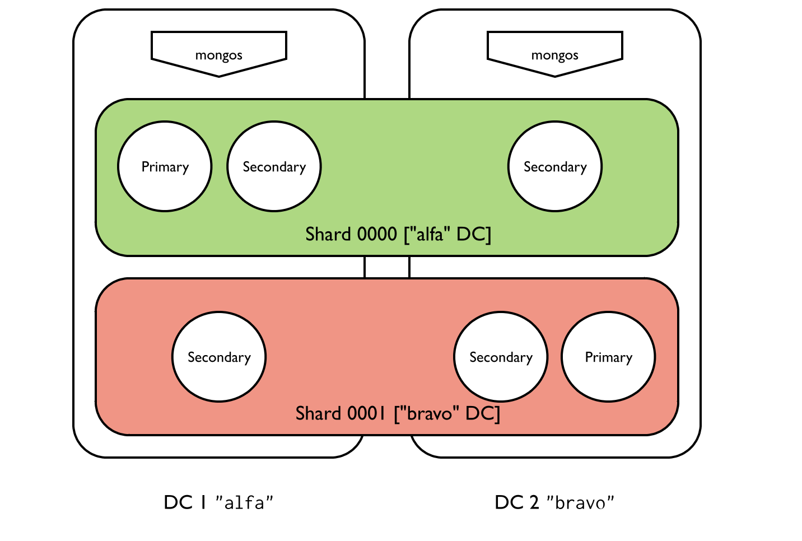

# 仅插入工作负载的分布式本地写入

[MongoDB 标签感知分片允许管理员通过定义分片键](https://www.mongodb.com/docs/v4.4/reference/glossary/#std-term-shard-key)的范围并将其标记到一个或多个分片来控制分片集群中的数据分布。

本教程使用[区域](https://www.mongodb.com/docs/v4.4/core/zone-sharding/#std-label-zone-sharding)以及多数据中心分片集群部署和应用程序端逻辑来支持分布式本地写入，以及在副本集选择或数据中心故障时提供高写入可用性。

*通过在对空的或不存在的集合进行分片之前*定义区域和区域范围，分片收集操作会为定义的区域范围创建块以及任何其他块以覆盖分片键值的整个范围，并执行初始操作基于区域范围的块分配。块的初始创建和分配允许更快地设置分区分片。初始分配后，平衡器管理后续的块分配

有关示例，请参阅[为空或不存在的集合预定义区域和区域范围。](https://www.mongodb.com/docs/v4.4/reference/method/sh.updateZoneKeyRange/#std-label-pre-define-zone-range-example)

> 重要的:
>
> 本教程中讨论的概念需要特定的部署体系结构以及应用程序级逻辑。
>
> 这些概念需要熟悉 MongoDB[分片集群](https://www.mongodb.com/docs/v4.4/reference/glossary/#std-term-sharded-cluster)、[副本集](https://www.mongodb.com/docs/v4.4/reference/glossary/#std-term-replica-set)和[区域的一般行为。](https://www.mongodb.com/docs/v4.4/core/zone-sharding/#std-label-zone-sharding)
>
> 本教程假设仅插入或插入密集型工作负载。本教程中讨论的概念和策略不太适合需要快速读取或更新的用例。

## 设想

考虑一个插入密集型应用程序，与写入相比，读取频率较低且优先级较低。该应用程序将文档写入分片集合，并需要数据库近乎恒定的正常运行时间来支持其 SLA 或 SLO。

下面是应用程序写入数据库的文档格式的部分视图：

```
{
   "_id" : ObjectId("56f08c447fe58b2e96f595fa"),
   "message_id" : 329620,
   "datacenter" : "alfa",
   "userid" : 123,
   ...
}
{
   "_id" : ObjectId("56f08c447fe58b2e96f595fb"),
   "message_id" : 578494,
   "datacenter" : "bravo",
   "userid" : 456,
   ...
}
{
   "_id" : ObjectId("56f08c447fe58b2e96f595fc"),
   "message_id" : 689979,
   "datacenter" : "bravo",
   "userid" : 789,
   ...
}
```

### 片键

该集合使用`{ datacenter : 1, userid : 1 }`复合索引作为[分片键。](https://www.mongodb.com/docs/v4.4/reference/glossary/#std-term-shard-key)

每个文档中的字段`datacenter`允许在每个不同的数据中心值上创建标签范围。如果没有该`datacenter`字段，就不可能将文档与特定数据中心关联起来

该字段为分片键`userid`提供了相对于 的高[基数](https://www.mongodb.com/docs/v4.4/core/sharding-shard-key/#std-label-shard-key-cardinality) 和低频[分量](https://www.mongodb.com/docs/v4.4/core/sharding-shard-key/#std-label-shard-key-frequency)`datacenter`。

[有关选择分片键](https://www.mongodb.com/docs/v4.4/core/sharding-shard-key/#std-label-sharding-shard-key-requirements)的更多一般说明，请参阅选择分片键。

### Architecture

该部署由两个数据中心组成，`alfa`并且`bravo`. 有两个分片，`shard0000`并且`shard0001`。每个分片都是一个包含三个成员的[副本集](https://www.mongodb.com/docs/v4.4/reference/glossary/#std-term-replica-set)。`shard0000`在 上有两名成员，在 上`alfa`有一名 [优先级 0 成员](https://www.mongodb.com/docs/v4.4/core/replica-set-priority-0-member/#std-label-replica-set-secondary-only-members)`bravo`。 `shard0001`在 上有两名成员，在 上`bravo`有一名[优先级 0 成员](https://www.mongodb.com/docs/v4.4/core/replica-set-priority-0-member/#std-label-replica-set-secondary-only-members)`alfa`。



### 标签

此应用程序需要每个数据中心一个标签。每个分片都会根据包含其大部分副本集成员的数据中心分配一个标签。有两个标签范围，每个数据中心一个。

**`alfa`数据中心**

将此数据中心上具有大多数成员的分片标记为`alfa`。

使用以下命令创建标签范围：

* 的下界`{ "datacenter" : "alfa", "userid" : MinKey }`，
* 的上限`{ "datacenter" : "alfa", "userid" : MaxKey }`，和
* 标签`alfa`

**`bravo`数据中心**

将此数据中心上具有大多数成员的分片标记为`bravo`。

使用以下命令创建标签范围：

* 的下界`{ "datacenter" : "bravo", "userid" : MinKey }`，
* 的上限`{ "datacenter" : "bravo", "userid" : MaxKey }`，和
* 标签`bravo`

> 笔记:
>
> MinKey和 [MaxKey](https://www.mongodb.com/docs/v4.4/reference/bson-types/)值是保留用于比较的特殊[值](https://www.mongodb.com/docs/v4.4/reference/bson-types/)
>
> 根据配置的标签和标签范围，[`mongos`](https://www.mongodb.com/docs/v4.4/reference/program/mongos/#mongodb-binary-bin.mongos)将文档路由 `datacenter : alfa`到`alfa`数据中心，并将文档路由 `datacenter : bravo`到`bravo`数据中心。

### 写操作

如果插入或更新的文档与配置的标签范围匹配，则只能将其写入具有相关标签的分片。

MongoDB 可以将与配置的标签范围不匹配的文档写入集群中的任何分片。

> 笔记:
>
> 上述行为要求集群处于稳定状态，没有块违反配置的标签范围。请参阅以下部分[平衡器](https://www.mongodb.com/docs/v4.4/tutorial/sharding-high-availability-writes/#std-label-sharding-high-availability-writes-balancing)了解更多信息。

### 平衡器

平衡器将标记[的](https://www.mongodb.com/docs/v4.4/core/sharding-balancer-administration/#std-label-sharding-balancing) 块[迁移到适当的分片。](https://www.mongodb.com/docs/v4.4/core/sharding-data-partitioning/#std-label-sharding-chunk-migration)在迁移之前，分片可能包含违反配置的标签范围和标签的块。平衡完成后，分片应仅包含其范围不违反其分配的标签和标签范围的块。

添加或删除标签或标签范围可能会导致块迁移。根据数据集的大小和标签范围影响的块的数量，这些迁移可能会影响集群性能。考虑在特定的计划窗口期间运行[平衡器](https://www.mongodb.com/docs/v4.4/core/sharding-balancer-administration/#std-label-sharding-balancing)。有关如何设置计划窗口的教程，请参阅计划[平衡窗口。](https://www.mongodb.com/docs/v4.4/tutorial/manage-sharded-cluster-balancer/#std-label-sharding-schedule-balancing-window)

### 应用程序行为

默认情况下，应用程序写入最近的数据中心。如果本地数据中心出现故障，或者在设定的时间段内未确认对该数据中心的写入，则应用程序会在尝试将文档写入数据库之前通过更改字段的值来切换到其他可用的数据中心`datacenter`。

该应用程序支持写入超时。应用程序使用 [Write Concern](https://www.mongodb.com/docs/v4.4/reference/write-concern/#std-label-write-concern)为每个写操作设置[超时](https://www.mongodb.com/docs/v4.4/reference/write-concern/#std-label-wc-wtimeout)。

如果应用程序遇到写入或超时错误，它会修改 `datacenter`每个文档中的字段并执行写入。这会将文档路由到另一个数据中心。如果两个数据中心均已关闭，则写入将无法成功。看[解决写入失败问题。](https://www.mongodb.com/docs/v4.4/tutorial/sharding-high-availability-writes/#std-label-sharding-high-availability-write-failure)

该应用程序定期检查与任何标记为“关闭”的数据中心的连接。如果连接恢复，应用程序可以继续执行正常的写入操作。

考虑到切换逻辑以及用于处理数据中心之间的客户端流量的任何负载平衡器或类似机制，应用程序无法预测给定文档被写入两个数据中心中的哪一个。为了确保读取操作中不会丢失任何文档，应用程序*必须*通过*不*将该字段包含在任何查询中来执行[广播查询。](https://www.mongodb.com/docs/v4.4/core/sharded-cluster-query-router/#std-label-sharding-mongos-broadcast)`datacenter`

应用程序使用[读取首选项](https://www.mongodb.com/docs/v4.4/core/read-preference/#std-label-read-preference)执行读取[`nearest`](https://www.mongodb.com/docs/v4.4/core/read-preference/#mongodb-readmode-nearest)以减少延迟。

尽管报告了超时错误，写入操作仍有可能成功。应用程序通过尝试将文档重新写入另一个数据中心来响应错误 - 这可能会导致文档在两个数据中心之间重复。该应用程序将解决重复项作为[读](https://www.mongodb.com/docs/v4.4/tutorial/sharding-high-availability-writes/#std-label-sharding-high-availability-writes-read-resolution)逻辑。

### 切换逻辑

如果一个或多个写入失败，或者写入在设定的时间段内未[得到确认，则应用程序具有切换数据中心的逻辑。](https://www.mongodb.com/docs/v4.4/reference/write-concern/#std-label-write-concern)应用程序`datacenter`根据目标数据中心的修改该字段[标签](https://www.mongodb.com/docs/v4.4/tutorial/sharding-high-availability-writes/#std-label-sharding-high-availability-tags)将文档定向到该数据中心。

例如，尝试写入`alfa`数据中心的应用程序可能遵循以下一般过程：

1. 尝试编写文档，指定`datacenter : alfa`.
2. 写入超时或错误时，记录`alfa`为暂时关闭。
3. 尝试编写相同的文档，修改`datacenter : bravo`.
4. 写入超时或错误时，记录`bravo`为暂时关闭。
5. 如果 和`alfa`都已`bravo`关闭，则记录并报告错误。

看[解决写入失败问题。](https://www.mongodb.com/docs/v4.4/tutorial/sharding-high-availability-writes/#std-label-sharding-high-availability-write-failure)

## 程序

### 配置分片标签

您必须连接到[`mongos`](https://www.mongodb.com/docs/v4.4/reference/program/mongos/#mongodb-binary-bin.mongos)与目标分 [片集群](https://www.mongodb.com/docs/v4.4/reference/glossary/#std-term-sharded-cluster)关联才能继续。[您无法通过直接连接到分片](https://www.mongodb.com/docs/v4.4/reference/glossary/#std-term-shard)副本集成员来创建标签。

1. 标记每个碎片

   `alfa`使用标签标记数据中心中的每个分片`alfa`。

   ```
   sh.addShardTag("shard0000", "alfa")
   ```

   `bravo`使用标签标记数据中心中的每个分片`bravo`。

   ```
   sh.addShardTag("shard0001", "bravo")
   ```

   您可以通过运行来查看分配给任何给定分片的标签 [`sh.status()`。](https://www.mongodb.com/docs/v4.4/reference/method/sh.status/#mongodb-method-sh.status)

2. 定义每个标签的范围.

   定义数据库的范围并 使用该方法`alfa`将其关联到标签。该方法需要：`alfa`[`sh.addTagRange()`](https://www.mongodb.com/docs/v4.4/reference/method/sh.addTagRange/#mongodb-method-sh.addTagRange)

   - 目标集合的完整命名空间。
   - 范围的下限（包含在内）。
   - 范围的唯一上限。
   - 标签的名称。

   ```
   sh.addTagRange( 
     "<database>.<collection>",
     { "datacenter" : "alfa", "userid" : MinKey },
     { "datacenter" : "alfa", "userid" : MaxKey }, 
     "alfa"
   )
   ```

   定义数据库的范围并使用该方法`bravo`将其关联到 标签。该方法需要：`bravo`[`sh.addTagRange()`](https://www.mongodb.com/docs/v4.4/reference/method/sh.addTagRange/#mongodb-method-sh.addTagRange)

   - 目标集合的完整命名空间。
   - 范围的下限（包含在内）。
   - 范围的唯一上限。
   - 标签的名称。

   ```
   sh.addTagRange( 
     "<database>.<collection>",
     { "datacenter" : "bravo", "userid" : MinKey },
     { "datacenter" : "bravo", "userid" : MaxKey }, 
     "bravo"
   )
   ```

   和值是保留用于比较的特殊值[`MinKey`](https://www.mongodb.com/docs/v4.4/reference/mongodb-extended-json/#mongodb-bsontype-MinKey)。始终比较小于所有其他可能的值，同时始终比较大于所有其他可能的值。配置的范围捕获每个用户。[`MaxKey`](https://www.mongodb.com/docs/v4.4/reference/mongodb-extended-json/#mongodb-bsontype-MaxKey)[`MinKey`](https://www.mongodb.com/docs/v4.4/reference/mongodb-extended-json/#mongodb-bsontype-MinKey)[`MaxKey`](https://www.mongodb.com/docs/v4.4/reference/mongodb-extended-json/#mongodb-bsontype-MaxKey)`datacenter`

3. 查看更改。

   下次[平衡器](https://www.mongodb.com/docs/v4.4/core/sharding-balancer-administration/#std-label-sharding-balancing)运行时，它会 根据标签范围和标签在分片之间[分割](https://www.mongodb.com/docs/v4.4/core/sharding-data-partitioning/#std-label-sharding-chunk-split)和 [迁移块。](https://www.mongodb.com/docs/v4.4/core/sharding-data-partitioning/#std-label-sharding-chunk-migration)

   平衡完成后，标记为的分片`alfa`应仅包含带有 的文档`datacenter : alfa`，而标记为的分片 `bravo`应仅包含带有 的文档`datacenter : bravo`。

   您可以通过运行来查看块分布[`sh.status()`。](https://www.mongodb.com/docs/v4.4/reference/method/sh.status/#mongodb-method-sh.status)

### 解决写入失败

当应用程序的默认数据中心关闭或无法访问时，应用程序会将该`datacenter`字段更改为其他数据中心。

`alfa`例如，应用程序默认尝试将以下文档写入数据 中心：

```
{
   "_id" : ObjectId("56f08c447fe58b2e96f595fa"),
   "message_id" : 329620,
   "datacenter" : "alfa",
   "userid" : 123,
   ...
}
```

如果应用程序在尝试写入时收到错误，或者写入确认花费的时间太长，则应用程序会将数据中心记录为不可用，并更改该`datacenter`字段以指向该`bravo` 数据中心。

```
{
   "_id" : ObjectId("56f08c457fe58b2e96f595fb"),
   "message_id" : 329620,
   "datacenter" : "bravo",
   "userid" : 123,
   ...
}
```

应用程序定期检查`alfa`数据中心的连接性。如果数据中心再次可访问，应用程序可以恢复正常写入。

> 笔记:
>
> 原始写入可能`datacenter : alfa`成功，特别是如果错误与[超时](https://www.mongodb.com/docs/v4.4/reference/write-concern/#std-label-wc-wtimeout)相关。`message_id : 329620`如果是这样，现在可以在两个数据中心之间复制该文档。应用程序必须解决重复项作为[读操作。](https://www.mongodb.com/docs/v4.4/tutorial/sharding-high-availability-writes/#std-label-sharding-high-availability-writes-read-resolution)

### 解决读取时的重复文档

应用程序的切换逻辑允许潜在的文档重复。执行读取时，应用程序会解析应用程序层上的任何重复文档。

以下查询搜索 为 的`userid`文档`123`。请注意，虽然`userid`是分片键的一部分，但查询中不包含该`datacenter`字段，因此不会执行 [定向读取操作。](https://www.mongodb.com/docs/v4.4/core/sharded-cluster-query-router/#std-label-sharding-mongos-targeted)

```
db.collection.find( { "userid" : 123 } )
```

结果显示，带有`message_id`of的文档`329620`已被插入 MongoDB 两次，可能是由于写入确认延迟造成的。

```
{
  "_id" : ObjectId("56f08c447fe58b2e96f595fa"),
  "message_id" : 329620
  "datacenter" : "alfa",
  "userid" : 123,
  data : {...}
}
{
  "_id" : ObjectId("56f08c457fe58b2e96f595fb"),
  "message_id" : 329620
  "datacenter" : "bravo",
  "userid" : 123,
  ...
}
```

应用程序可以忽略重复项，获取两个文档之一，也可以尝试修剪重复项，直到只剩下一个文档。

修剪重复项的一种方法是使用该 [`ObjectId.getTimestamp()`](https://www.mongodb.com/docs/v4.4/reference/method/ObjectId.getTimestamp/#mongodb-method-ObjectId.getTimestamp)方法从字段中提取时间戳 `_id`。然后，应用程序可以保留插入的第一个文档或最后插入的文档。这假设该 `_id`字段使用 MongoDB [`ObjectId()`。](https://www.mongodb.com/docs/v4.4/reference/method/ObjectId/#mongodb-method-ObjectId)

例如，[`getTimestamp()`](https://www.mongodb.com/docs/v4.4/reference/method/ObjectId.getTimestamp/#mongodb-method-ObjectId.getTimestamp)在带有返回的文档上使用`ObjectId("56f08c447fe58b2e96f595fa")`：

```
ISODate("2016-03-22T00:05:24Z")
```

[`getTimestamp()`](https://www.mongodb.com/docs/v4.4/reference/method/ObjectId.getTimestamp/#mongodb-method-ObjectId.getTimestamp)在带有退货的文档上 使用`ObjectId("56f08c457fe58b2e96f595fb")`：

```
ISODate("2016-03-22T00:05:25Z")
```


译者：韩鹏帅

原文 - [Distributed Local Writes for Insert Only Workloads]( https://docs.mongodb.com/manual/tutorial/sharding-high-availability-writes/ )

